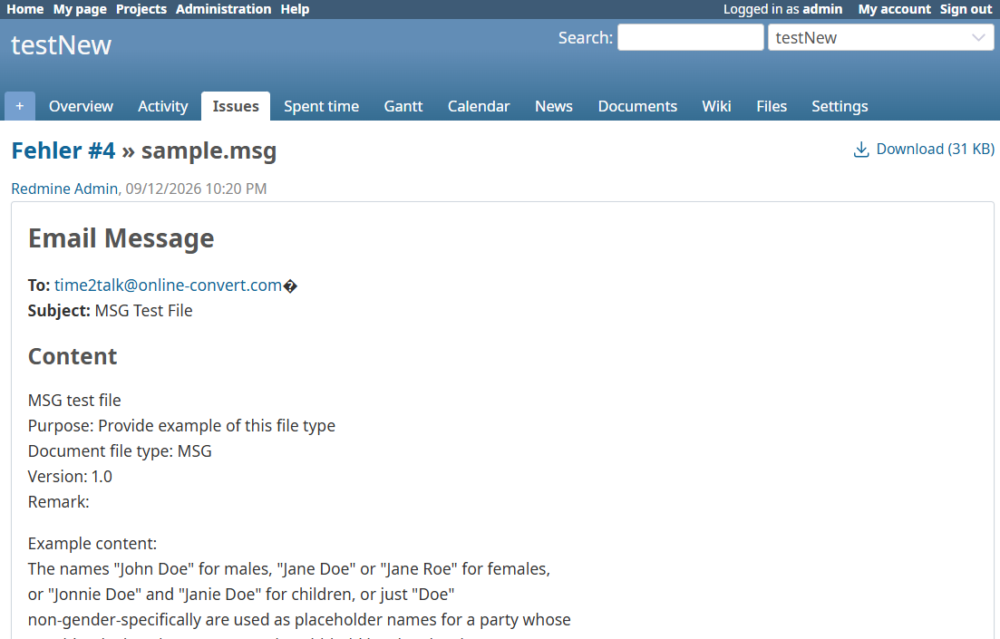
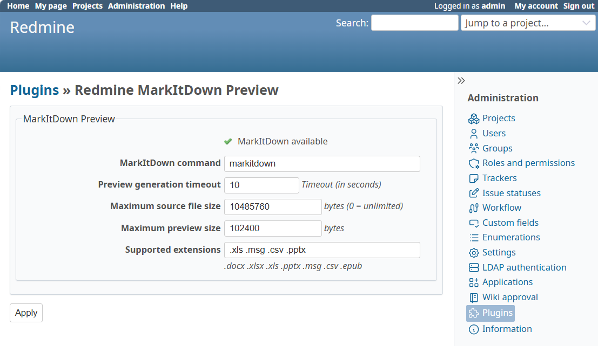

# Redmine MarkItDown Preview

[](https://github.com/flowalchs/redmine_markitdown_preview/actions/workflows/build.yml)
[](https://github.com/flowalchs/redmine_markitdown_preview/releases/latest)
[](https://www.redmine.org/plugins/redmine_markitdown_preview)
[](https://www.redmine.org)
[](https://codecov.io/gh/flowalchs/redmine_markitdown_preview)

This plugin adds attachment previews using [Microsoft MarkItDown](https://github.com/microsoft/markitdown) converter for Office documents, Outlook messages and other supported formats.

## Overview

Inspired by the preview architecture introduced in Redmine 7, the plugin converts supported attachments into Markdown (`.md`) files and renders them using Redmine's built-in Markdown preview pipeline.

It can be used:

- on Redmine versions that do not provide Pandoc previews
- as an additional converter for formats not covered by your current setup
- alongside the Redmine 7 preview implementation by configuring different file extensions

The plugin focuses on providing lightweight, searchable previews of document content directly inside Redmine.

## Features

- Markdown based attachment previews
- Outlook `.msg` preview support
- Excel `.xls` preview support
- Microsoft Office document previews (`.docx`, `.xlsx`, `.pptx`)
- EPUB preview support
- Preview caching for improved performance
- Compatible with older Redmine releases
- Can be used together with Redmine's Pandoc preview implementation
- Flexible configuration options

### Document Content

MarkItDown previews focus on textual document content.

Currently, embedded images contained in Office documents (for example `.docx` files) are not exported into the generated Markdown preview. Such images are therefore not displayed in the rendered Redmine preview.

The original attachment itself remains unaffected and can still be downloaded normally.

## Rendering and Security

MarkItDown previews are generated as Markdown files and rendered using Redmine's standard Markdown renderer.

Benefits of this approach:

- Uses Redmine's existing rendering pipeline
- Uses Redmine's existing sanitization and security mechanisms
- JavaScript and unsafe HTML are filtered by Redmine
- No custom HTML renderer is introduced
- Preview content behaves exactly like regular Markdown content in Redmine

Generated previews are stored as cached `.md` files and rendered through the normal Redmine view layer.

## Screenshots

<div align="left">
  <table>
    <tr>
      <td align="center">
        
        <br>
        <sub><b>Preview .msg</b></sub>
      </td>
      <td align="center">
        
        <br>
        <sub><b>Plugin Settings</b></sub>
      </td>
    </tr>
  </table>  
</div>

## Typical Usage

The plugin can be used in different ways:

### Older Redmine Versions

Provide attachment previews on Redmine installations that do not include the Redmine 7 Pandoc preview functionality.

### Additional Format Coverage

Use MarkItDown for formats such as:

```text
.msg
.xls
.csv
.epub
```

## Supported Formats

Typical supported formats include:

```text
.docx
.xlsx
.xls
.pptx
.msg
.csv
.epub
```

Additional extensions can be configured from the plugin settings page.

## Requirements

### Redmine

- Redmine 5 or newer

### Microsoft MarkItDown

Install MarkItDown on the Redmine server:

```bash
pip install markitdown
```

Verify the installation:

```bash
markitdown --version
```

## Installation

```bash
cd $REDMINE_ROOT/plugins

git clone https://github.com/flowalchs/redmine_markitdown_preview.git
```

Install dependencies:

```bash
cd $REDMINE_ROOT

bundle install
```

Restart Redmine.

## Configuration

Navigate to:

```text
Administration → Plugins → Redmine MarkItDown Preview → Configure
```

Available settings:

| Setting                    | Description                                      |
| -------------------------- | ------------------------------------------------ |
| MarkItDown command         | Path to the MarkItDown executable                |
| Preview generation timeout | Maximum conversion time in seconds               |
| Maximum source file size   | Skip conversion for files larger than this limit |
| Maximum preview size       | Maximum generated preview size                   |
| Supported extensions       | Space separated list of supported extensions     |

Example:

```text
.xls .msg .csv
```

## Preview Cache

Generated previews are stored below:

```text
files/
└── derived_cache/
    └── markitdown_previews/
```

The cache is automatically reused for subsequent requests.

Preview files are automatically removed when the corresponding attachment is deleted.

## How It Works

1. User opens an attachment
2. Plugin checks whether the attachment is previewable
3. MarkItDown converts
4. Preview `.md` file

## Uninstall

No database tables or migrations are created by this plugin.  
To uninstall, simply remove the plugin directory:

```bash
rm -rf plugins/redmine_markitdown_preview
```

Optionally, remove the generated preview cache:

```bash
rm -rf files/derived_cache/markitdown_previews
```

This only removes generated Markdown preview files and does not affect original attachments.

## Contributing
Pull requests, translations, and feedback are welcome.

## License
MIT License